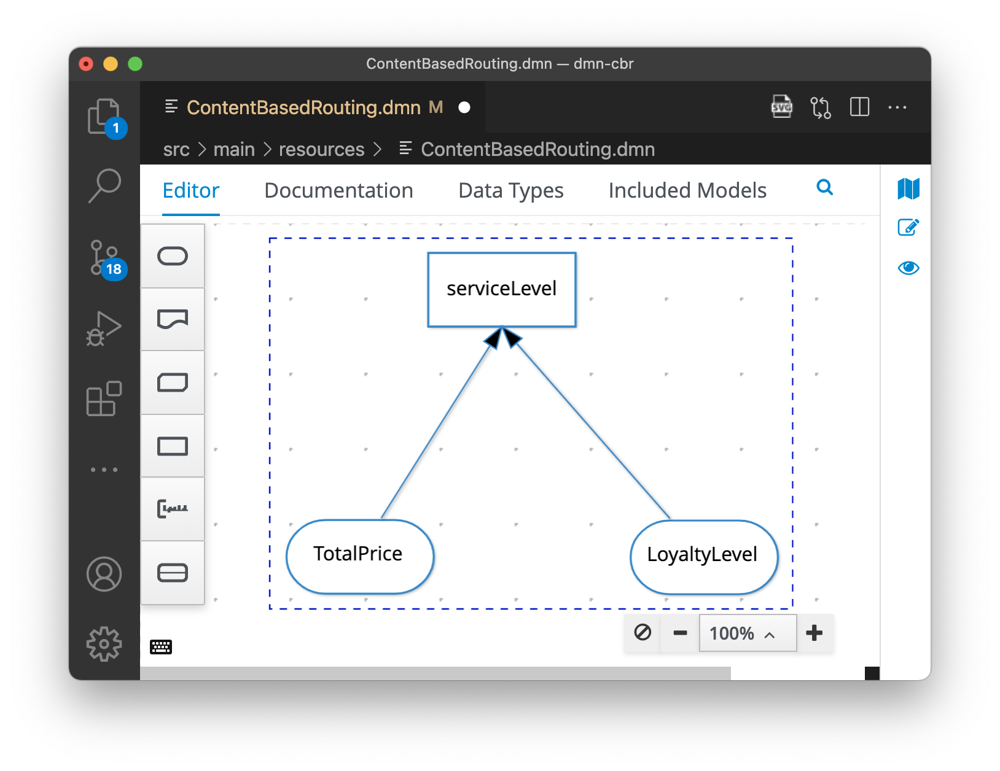
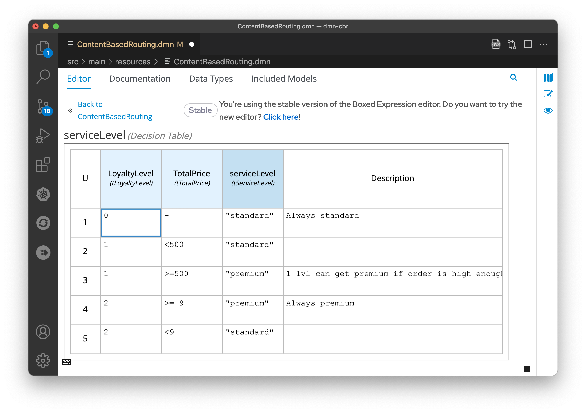

# Content based routing with DMN

## Description

A simple DMN service to evaluate a order level. Result is used by Camel route.

Service takes two elements in:


And uses those elements to decide serviceLevel:


## Deployment
There are many ways how one can deploy this to OpenShift:

* The barebones way is to containerize the apps locally and get them running on OpenShift.
* Using source-to-image (s2i). One can point OpenShift to this git repo and ask it to clone it, select the correct subdir, then build the jar and containerize it and then run it.
* Using operator. Operator has two CRDs (k8s custom resource definitions), one is for building the app and another is for the runtime.

## Remote Git repo with source-to-image build with JVM runtime

First login to OpenShift, select the project

```oc login ...```

```oc project project-name-here```

See what builders you have:

```oc get imagestreams -n openshift | grep openjdk```

For example, if you have ubi8-openjdk-11 and tag 1.3:

```
oc new-app ubi8-openjdk-11:1.3~https://github.com/tfriman/camel-dmn-cbr.git --context-dir=dmn-cbr --name=s2i-dmn-cbr

oc logs -f BC/s2i-dmn-cbr

oc create route edge s2i-dmn-cbr --service=s2i-dmn-cbr
```

Access the app:

```
export url=$(oc get route s2i-dmn-cbr -o go-template='{{.spec.host}}')
```

Open https://$url/q/swagger-ui

Note: URLs are http, not https. Beware when accessing with Chromium based browsers which guess the url to be https always.


## Source-to-image build without operator

First add s2i and openshift client to pom.xml:

```mvn quarkus:add-extension -Dextensions="openshift"```

Then login to OpenShift, select the project

```oc login ...```

```oc project project-name-here```

Start build:

```mvn clean package -Dquarkus.container-image.build=true -Dquarkus.kubernetes-client.trust-certs=true```

Deploy the built image to OpenShift:

To see what you have available:

```
oc get imagestream
```

Deploy it (Assuming normal naming and versioning here from pom.xml, artifactId and version)

```
oc new-app --name=dmn-cbr dmn-cbr:1.0.0
oc create route edge dmn-cbr --service=dmn-cbr
```

Get url:

```
export url=$(oc get route dmn-cbr -o go-template='{{.spec.host}}')
```

Open https://$url/q/swagger-ui to access the app.

For more info, see https://quarkus.io/version/2.2/guides/deploying-to-openshift

## Running DMN with Kogito operator

Install RHPAM Kogito Operator to your OpenShift. Create a project to host your stuff. See [official docs](https://access.redhat.com/documentation/en-us/red_hat_decision_manager/7.12/html/getting_started_with_red_hat_build_of_kogito_in_red_hat_decision_manager/con-kogito-operator-deployment-options_deploying-kogito-microservices-on-openshift) for more info.

See [openshift](./openshift) dir for yaml definitions.


### Binary build locally using operator

Create a binary build for your app:

```cd dmn-cbr```

Login to OpenShift, select the project you are using.

```oc login ...```

```oc project project-name-here```

Then create the binary build:

```
oc apply -f openshift/operator/kogito-dmn-binary.yaml
```

Run ```mvn package``` to get the local uber jar.

Start the build. It will upload the target dir to OpenShift and then OpenShift will containerize it.

```
oc start-build dmn-binary --from-dir=target --follow
```

When complete, deploy:
```
oc apply -f openshift/operator/kogito-dmn-binary-runtime.yaml
```

To see the routes:
```
oc get routes
```

Now you can call it to see result:
```
bin/send.sh dmn-binary
```

Example response:
```json
{"TotalPrice":9,"LoyaltyLevel":2,"serviceLevel":"standard"}
```
